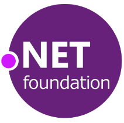

  

# Contributing to this repository

[Code of Conduct](CODE_OF_CONDUCT.md)

[How Can I Contribute?](#how-can-i-contribute)
- [Contributing to this repository](#contributing-to-this-repository)
- [Code of Conduct](#code-of-conduct)
- [How Can I Contribute?](#how-can-i-contribute)
  - [Suggesting Ideas To The Membership Committee](#suggesting-ideas-to-the-membership-committee)
  - [Suggesting Enhancements To This Repository](#suggesting-enhancements-to-this-repository)
- [Raising Pull Requests](#raising-pull-requests)
- [Licensing](#licensing)

# Code of Conduct

Please read and refer to [this file](../CODE_OF_CONDUCT.md) and it's links.

# How Can I Contribute?

There are many ways you can help the .NET Foundation Membership Committee:
- Join us
- Send us your suggestions to improve the membership offering
- Contribute to the repository

## Suggesting Ideas To The Membership Committee

- Head to the `Issues` section of this repository. 
- Select the `Idea For Membership Committee` issue template
- Fill in the details and submit

If you assign one of the members of the committee, we will aim to discuss the idea in an upcoming meeting. Alternatively you can come to a meeting and present it yourself.

## Suggesting Enhancements To This Repository

- Head to the `Issues` section of this repository. 
- Select the `Change for Repository` issue template
- Fill in the details and submit

# Raising Pull Requests

- Fork the repository
- Open a branch and commit your changes
- Raise a pull request and fill in the information asked for in the description
- The membership committee will automatically be added as reviewers as code owners of this repository

# Licensing
[Repo license file](./../LICENSE)