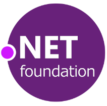

  

# Welcome

The Outreach Committee is here to welcome developers of all backgrounds, education, and technology ecosystems into the .NET ecosystem. We are here to help you organize and evangelize. [See more about .NET Foundation committees here](https://dotnetfoundation.org/community/committees).

**Chairperson(s):** Lou Creemers

**Meets:** 2nd Monday of every month at 4:00 pm ET (8:00 pm UTC during winter / 7:00pm UTC otherwise)

**Meeting Link:** <https://discord.gg/tvYjX73wUW> (Look under events)

**Repository:** https://github.com/dotnet-foundation/wg-outreach

## Contributing

Please refer to our [Contributing file](./.github/CONTRIBUTING.md) for how to contribute.

## High-Level Goals of the .NET Foundation Outreach Committee

* Encourage new developers to build with .NET
* Empower underrepresented regions to spawn leaders and contributors in the .NET community.
* Assist event and/or user group organizers with evangelism and growth of attendance

## Joining the Committee & Meetings

The Outreach Committee currently meets for one hour on the **2nd Monday of every month at 4:00 pm ET**. Meetings are held on Microsoft Teams. If you are passionate about Community Outreach and .NET Advocacy, we would love to hear from you!

To join the committee:
- Join the [.NET Foundation Discord](https://discord.gg/tvYjX73wUW)
- Join us for the next outreach meeting (see [Meeting Link](#meeting-link))
- [Create an issue](https://github.com/dotnet-foundation/wg-outreach/issues/new/choose) using the "Membership Request" template
- The chair will review the issue and act on it.

Meeting notes are available in the [Meetings](Meetings) folder. This repo is public to support transparency and open participation. If you have questions, please open a discussion.

We have several ongoing Outreach initiatives that will benefit from motivated Foundation members who can commit some of their volunteer time toward making the .NET ecosystem more welcoming and robust for communities around the world.

## Current Initiatives

### Virtual Meetups

To participate in the [.NET Virtual Meetup](https://www.meetup.com/dotnet-virtual-user-group/) or to have your local community's meetup streamed on the [.NET Foundation YouTube](https://www.youtube.com/channel/UCiaZbznpWV1o-KLxj8zqR6A) account, please submit your meetup information via [this form](https://bit.ly/2OohRR2). You can read more about the Virtual Meetups at [.NET Foundation Virtual Meetups](/virtual_meetup).

### Underrepresented Communities

Recently, the Outreach Committee has taken the first steps toward its goal of empowering leaders and contributors in growing .NET communities in underrepresented areas around the world. We already know that amazing developers and community organizers can be found everywhere. Our goal—working with leaders in Africa, South Asia, and South and Central America—is to promote the work of these communities and to foster improved cross-collaboration and learning among such geographically widespread and diverse developers.

### Speaker Directory

The Outreach Committee is actively shepherding an effort to create a global .NET speaker directory. If you are a speaker from anywhere around the world, and you want to help user groups and conferences find you for .NET topics, the [speaker directory](https://dotnetfoundation.org/community/speakers) can help!

## Proposals

We are about empowering you and your organizations. If you have an idea of how we can help, please post an [Issue](https://github.com/dotnet-foundation/wg-outreach/issues/new/choose) in the GitHub repository for the working group. You can see more about the proposal process (still a work-in-progress) in our [guide to proposals](https://github.com/dotnet-foundation/wg-outreach/blob/main/proposals.md).

## Current Membership

**Chair:** Lou Creemers

**Scribe(s):** Angela Cruz

## Code Of Conduct

[See the Code of Conduct here](CODE_OF_CONDUCT.md).
